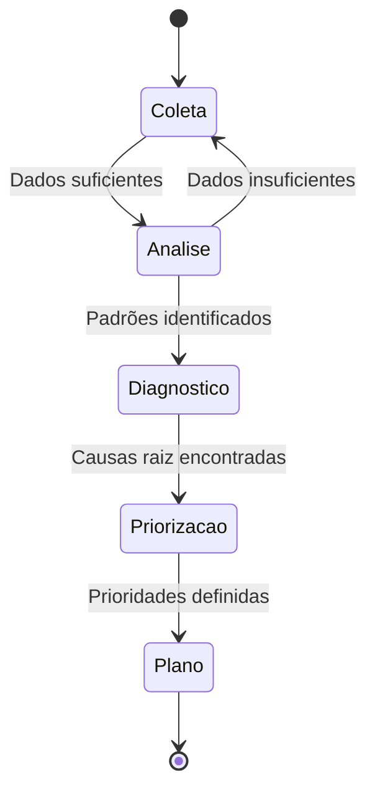
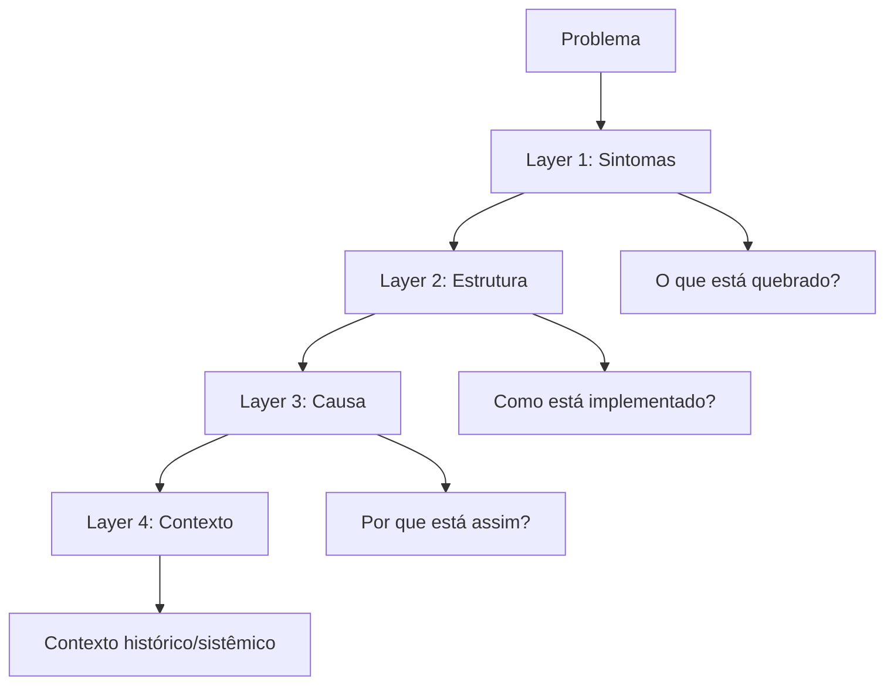
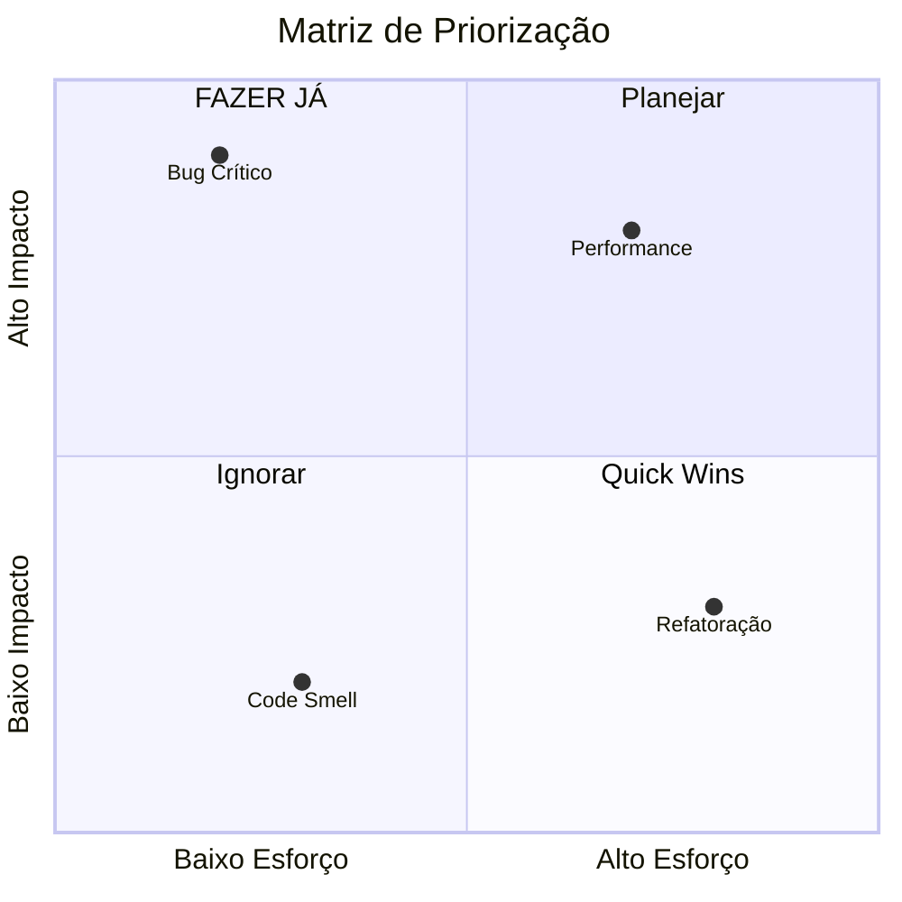

# 🔍 Workflow: Análise de Problemas

## Visão Geral do Workflow



## Passo 1: Coleta de Evidências

```markdown
### Template: Coleta de Dados

**Sintomas Observados:**
- [Comportamento anormal]
- [Frequência: sempre/intermitente]
- [Quando começou]

**Logs Relevantes:**
```
[logs aqui]
```

**Métricas:**
- Latência: [valor]
- Error rate: [valor]
- Throughput: [valor]

**Código Suspeito:**
```[language]
[código]
```
```

## Passo 2: Análise Multi-Camada



## Passo 3: Root Cause Analysis

Use 5 Whys + First Principles:

```markdown
**5 Whys:**
Problema: [sintoma]
Por quê 1? → [causa 1]
Por quê 2? → [causa 2]
Por quê 3? → [causa 3]
Por quê 4? → [causa 4]
Por quê 5? → [CAUSA RAIZ]

**First Principles:**
- Suposição identificada: [X]
- Validação: [como testar]
- Resultado: [válida ou inválida]
```

## Passo 4: Priorização



## Passo 5: Plano de Ação

```markdown
### Output Final: Plano de Ação

**Problema Identificado:** [nome]
**Causa Raiz:** [descrição]
**Prioridade:** [P0-P3]

**Soluções (Ordenadas):**
1. **[Solução 1]** - P0
   - Ação: [o que fazer]
   - Esforço: [tempo]
   - Impacto: [esperado]
   - Owner: [quem]

2. **[Solução 2]** - P1
   [...]

**Métricas de Sucesso:**
- [ ] [Métrica 1] atingida
- [ ] [Métrica 2] atingida

**Riscos:**
- Risco 1: [descrição + mitigação]
```

---

**Tags:** #workflow #analise #rca #diagnostico

**Relacionados:**
- [[../3-thinking/01-metodologias-analise-profunda]]
- [[02-workflow-design-solucoes]]
