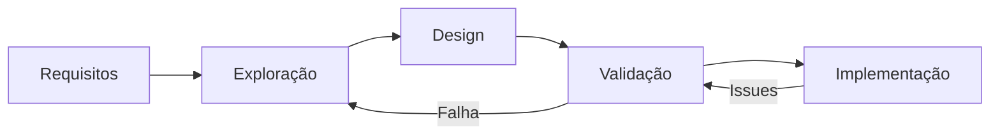
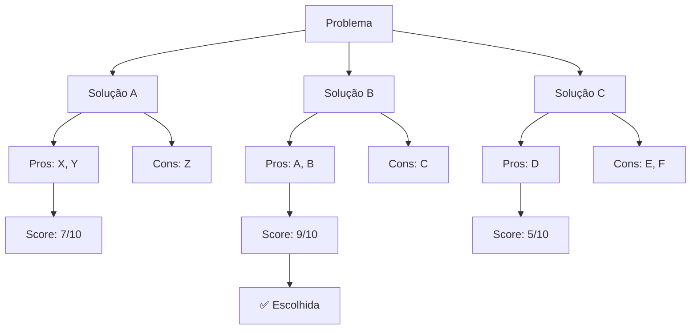
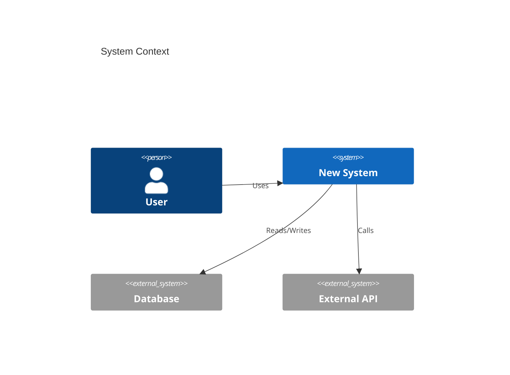

# 🏗️ Workflow: Design de Soluções

## Visão Geral



## Passo 1: Especificação de Requisitos

```markdown
### Requisitos Funcionais
- RF1: Sistema deve [ação]
- RF2: API deve retornar [formato]

### Requisitos Não-Funcionais
- RNF1: Latência p95 < [X]ms
- RNF2: Disponibilidade > [Y]%

### Constraints
- Não pode mudar [X]
- Budget: $[Y]/mês
- Prazo: [Z] semanas
```

## Passo 2: Exploração de Alternativas



## Passo 3: Design Detalhado



```markdown
### Componentes Principais
1. **API Layer**
   - Responsabilidade: [X]
   - Tecnologia: [Y]
   - Interface: [endpoints]

2. **Business Logic**
   - [...]

3. **Data Layer**
   - [...]
```

## Passo 4: Validação

```markdown
### Checklist de Validação

**Requisitos:**
- [ ] Atende RF1, RF2, ...?
- [ ] Atende RNF1, RNF2, ...?
- [ ] Respeita constraints?

**Design:**
- [ ] Escalável?
- [ ] Testável?
- [ ] Manutenível?

**Riscos:**
- [ ] Riscos técnicos mitigados?
- [ ] Plano B existe?
```

---

**Tags:** #workflow #design #arquitetura #validacao

**Relacionados:**
- [[01-workflow-analise-problemas]]
- [[03-workflow-documentacao-tecnica]]
- [[../3-thinking/03-decomposicao-problemas-complexos]]
