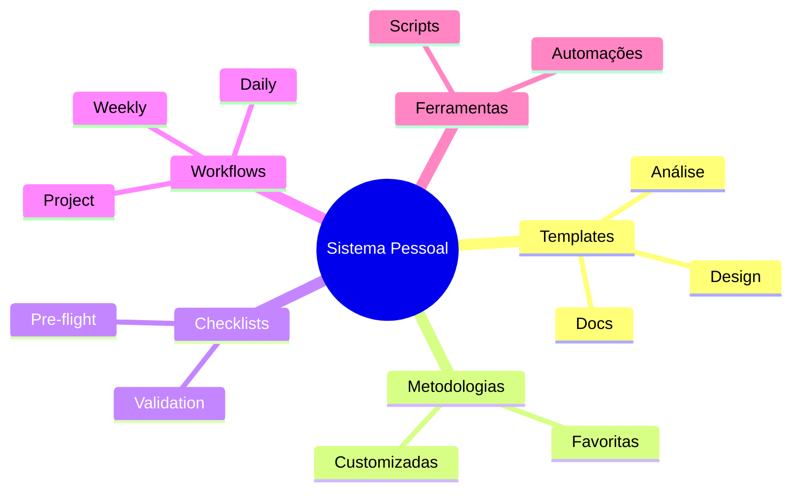
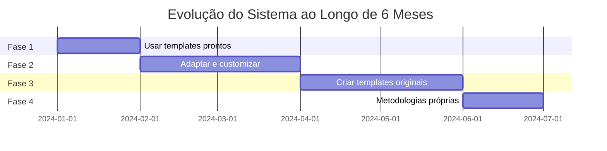

# 🛠️ Construção de Sistema Pessoal

## Seu Toolkit Personalizado



## Evolução do Sistema



## Componentes do Sistema

### 1. Template Library Pessoal
```
templates/
├── analysis/
│   ├── quick-audit.md
│   ├── deep-dive.md
│   └── custom-domain-X.md
├── design/
└── docs/
```

### 2. Automation Scripts
```bash
# Exemplo: script de validação
./validate-template.sh template.md
./run-analysis.sh codebase/
```

### 3. Personal Checklist Collection
```markdown
- pre-analysis.md
- pre-design.md
- pre-implementation.md
- post-project-review.md
```

## Métricas de Sucesso

| Métrica | Baseline | Target | Atual |
|---------|----------|--------|-------|
| Tempo de análise | 8h | 2h | 3h |
| Reuso de templates | 20% | 80% | 65% |
| Qualidade de output | 6/10 | 9/10 | 8/10 |
| Satisfação pessoal | 5/10 | 9/10 | 8/10 |

---

**Tags:** #sistema-pessoal #toolkit #customizacao #evolucao
