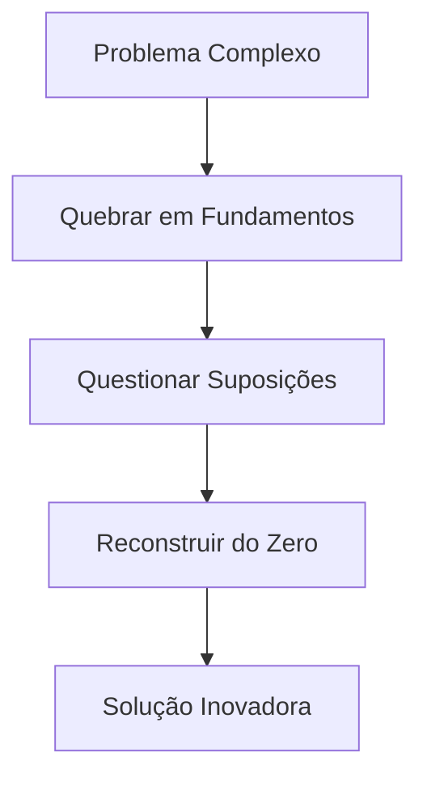
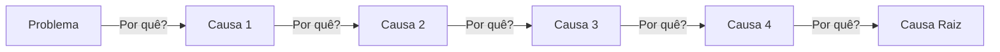
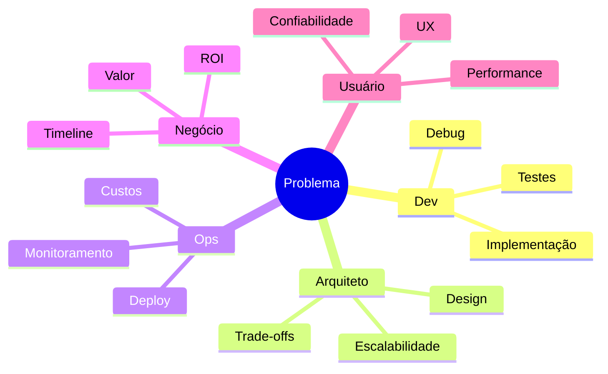
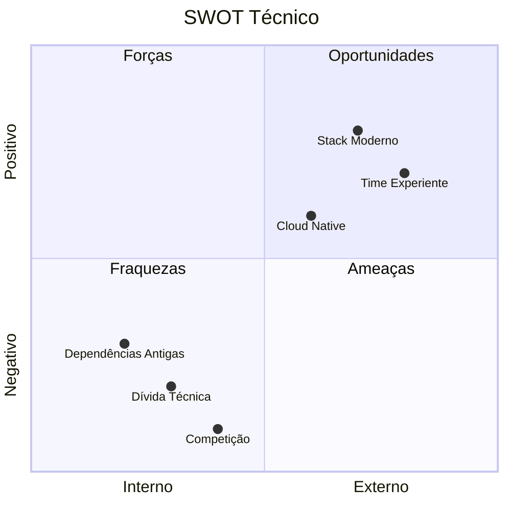
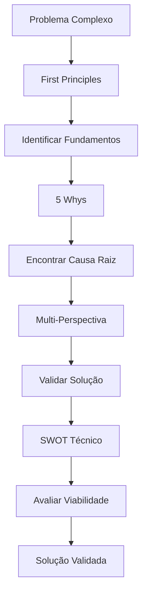

# 🔬 Metodologias de Análise Profunda

## Introdução

Análise superficial vê sintomas. Análise profunda encontra causas raiz. Este guia apresenta frameworks sistemáticos para análise em múltiplas camadas.

## Framework 1: First Principles (Primeiros Princípios)

**Quando usar:** Problemas complexos onde soluções convencionais falharam.



**Exemplo Prático:**

```markdown
Problema: "Sistema de cache está lento"

Análise Convencional:
→ "Adicione mais RAM"

First Principles:
1. Por quê precisamos de cache? → Reduzir latência de DB
2. Por quê DB é lento? → Queries sem índice
3. Por quê não indexar? → Suposição: "índices custam muito"
4. Validar suposição → Teste: índices custam 5% espaço, ganham 10x speed
5. Solução real: Índices estratégicos (não mais cache)
```

## Framework 2: 5 Whys (5 Porquês)



**Template:**
```
Problema: [sintoma observado]
Por quê 1? → [resposta]
Por quê 2? → [resposta]
Por quê 3? → [resposta]
Por quê 4? → [resposta]
Por quê 5? → [causa raiz]
Solução: [atacar causa raiz, não sintoma]
```

## Framework 3: Análise Multi-Perspectiva



**Aplicação:** Analise o mesmo problema de 5 perspectivas diferentes.

## Framework 4: SWOT Técnico



## Combinando Metodologias



---

**Tags:** #metodologias #first-principles #5-whys #analise-profunda

**Relacionados:**
- [[02-deteccao-padroes-sistematica]]
- [[../4-workflows/01-workflow-analise-problemas]]
