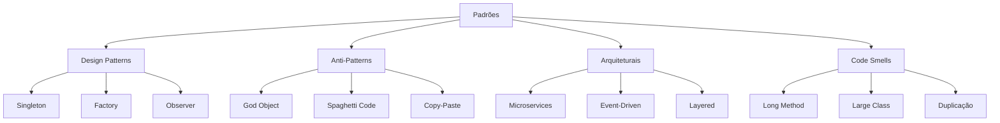
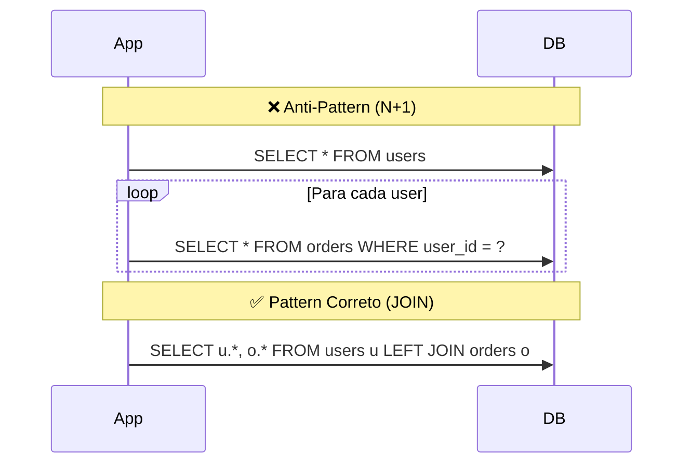
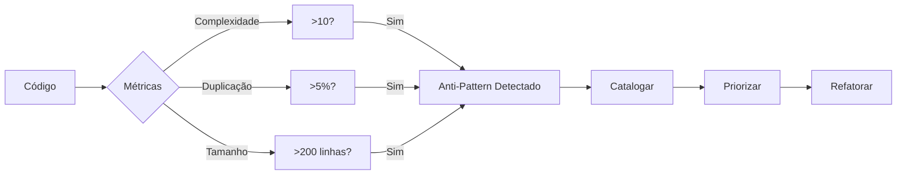

# 🔍 Detecção de Padrões Sistemática

## Introdução

Reconhecer padrões = Resolver problemas 10x mais rápido. Este guia ensina como detectar patterns e anti-patterns sistematicamente.

## Tipos de Padrões



## Anti-Patterns Comuns

### 1. God Object (Objeto Deus)

**Sintomas:**
- Classe com 1000+ linhas
- 50+ métodos
- Múltiplas responsabilidades

**Detecção:**
```bash
# Encontrar classes gigantes
find . -name "*.js" -exec wc -l {} \; | sort -rn | head -10
```

**Solução:** Single Responsibility Principle

### 2. Query N+1



### 3. Callback Hell

```javascript
// ❌ Anti-Pattern
getData(function(a){
  getMoreData(a, function(b){
    getEvenMore(b, function(c){ 
      // ...hell
    });
  });
});

// ✅ Pattern Correto
const a = await getData();
const b = await getMoreData(a);
const c = await getEvenMore(b);
```

## Framework de Detecção



## Heurísticas de Detecção

| Heurística | Threshold | Ferramenta |
|------------|-----------|------------|
| Complexidade Ciclomática | >10 | ESLint, SonarQube |
| Duplicação de Código | >5% | PMD, CPD |
| Tamanho de Função | >50 linhas | Custom script |
| Profundidade de Herança | >4 níveis | Metrics tool |
| Acoplamento | >10 dependências | Dependency graph |

## Checklist de Padrões

```markdown
## Code Review Pattern Detection

- [ ] God Objects? (classes >500 linhas)
- [ ] Long Methods? (funções >50 linhas)
- [ ] Duplicação? (DRY violado)
- [ ] Query N+1? (loops com DB calls)
- [ ] Callback Hell? (pyramids of doom)
- [ ] Magic Numbers? (hardcoded values)
- [ ] Dead Code? (unused functions)
```

---

**Tags:** #patterns #anti-patterns #detection #heuristics

**Relacionados:**
- [[01-metodologias-analise-profunda]]
- [[03-decomposicao-problemas-complexos]]
- [[../5-meta/03-documentacao-aprendizados]]
