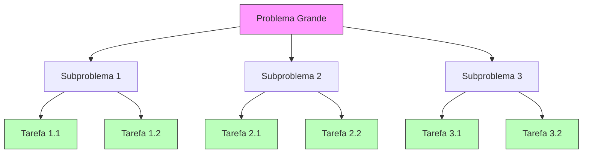
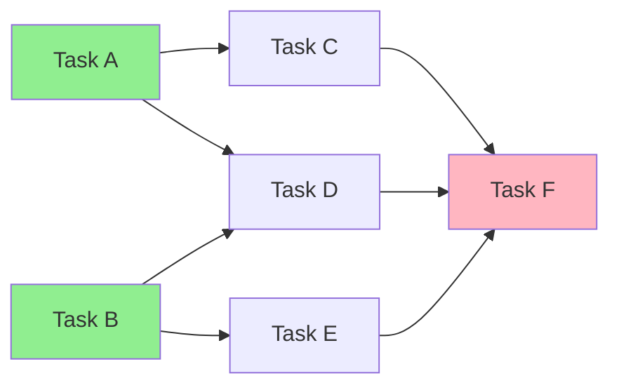
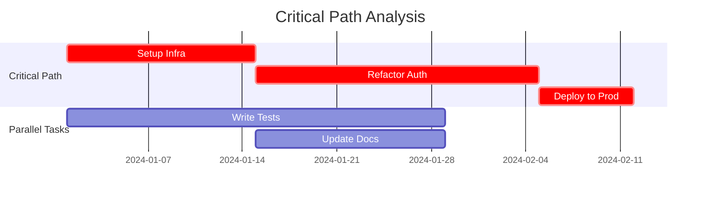
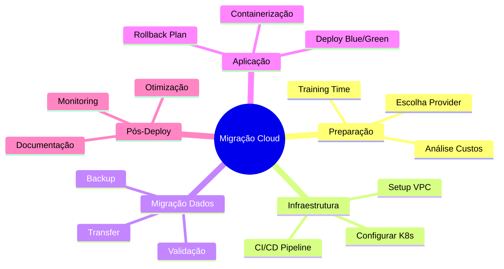
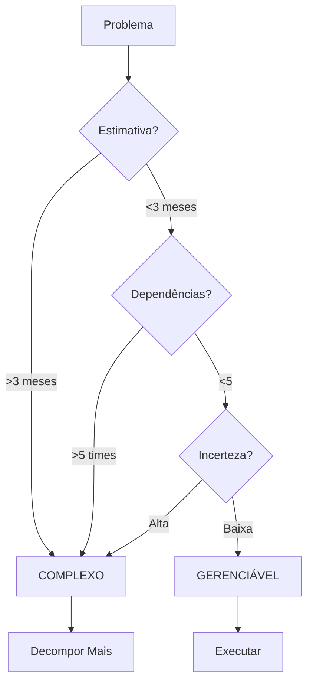

# 🧩 Decomposição de Problemas Complexos

## Introdução

Problemas complexos paralisam. Decomposição torna o impossível possível. Este guia ensina frameworks de quebra sistemática.

## Técnica 1: Divide & Conquer



**Exemplo:**

```markdown
Problema: Refatorar sistema legado de 100k linhas

Decomposição:
├── 1. Análise (2 semanas)
│   ├── 1.1 Mapear dependências
│   ├── 1.2 Identificar módulos
│   └── 1.3 Priorizar por risco
├── 2. Infraestrutura (3 semanas)
│   ├── 2.1 Setup CI/CD
│   ├── 2.2 Testes de integração
│   └── 2.3 Feature flags
└── 3. Refatoração Incremental (12 semanas)
    ├── 3.1 Módulo Auth (3 sem)
    ├── 3.2 Módulo Payment (4 sem)
    └── 3.3 Módulo Reports (5 sem)
```

## Técnica 2: Dependency Mapping



**Legenda:**
- Verde: Pode começar imediatamente (sem dependências)
- Branco: Depende de outros
- Rosa: Task final (depende de tudo)

## Técnica 3: Critical Path Method



**Caminho crítico:** Setup → Refactor → Deploy (6 semanas)
**Paralelizável:** Tests, Docs (economiza tempo)

## Técnica 4: Work Breakdown Structure (WBS)



## Template de Decomposição

```markdown
# Problema: [Nome do Problema Grande]

## 1. Análise Inicial
- Tamanho estimado: [X semanas/meses]
- Complexidade: [Alta/Média/Baixa]
- Risco: [Alto/Médio/Baixo]

## 2. Decomposição (3-5 níveis)
```
[WBS aqui]
```

## 3. Dependency Map
```
[Diagrama de dependências]
```

## 4. Critical Path
```
[Gantt chart]
```

## 5. Fases de Execução
- Fase 1: [Quick Wins - 2 semanas]
- Fase 2: [Foundation - 4 semanas]
- Fase 3: [Core - 8 semanas]
- Fase 4: [Polish - 2 semanas]

## 6. Checkpoints
- Checkpoint 1 (Semana 2): [Critério de sucesso]
- Checkpoint 2 (Semana 6): [Critério de sucesso]
- Checkpoint 3 (Semana 14): [Critério de sucesso]
```

## Quando Problema é "Complexo Demais"?



---

**Tags:** #decomposicao #divide-conquer #critical-path #wbs

**Relacionados:**
- [[01-metodologias-analise-profunda]]
- [[../4-workflows/01-workflow-analise-problemas]]
