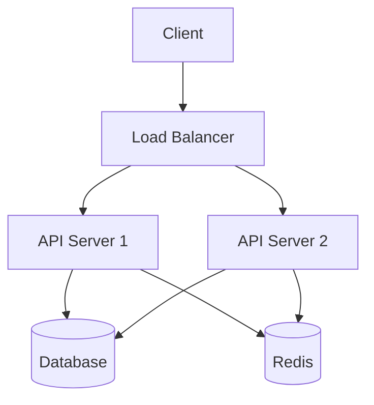

# 📚 Workflow: Documentação Técnica

## Processo de Documentação

```mermaid
sequenceDiagram
    participant Dev
    participant IA
    participant Review
    participant Publish
    
    Dev->>IA: Código + Contexto
    IA->>Dev: Draft de Docs
    Dev->>Review: Validar Técnicamente
    Review->>Dev: Feedback
    Dev->>IA: Refinar
    IA->>Publish: Docs Finalizadas
```



## Template: Documentação de API

```markdown
# API Documentation

## Endpoint: POST /api/resource

**Descrição:** [O que faz]

**Autenticação:** Bearer Token

**Request:**
```json
{
  "field": "type (description)"
}
```

**Response 200:**
```json
{
  "result": "success"
}
```

**Errors:**
| Code | Description | Solution |
|------|-------------|----------|
| 400  | Invalid input | Check field X |
| 401  | Unauthorized | Verify token |

**Example:**
```bash
curl -X POST /api/resource \
  -H "Authorization: Bearer TOKEN" \
  -d '{"field": "value"}'
```
```

## Template: Arquitetura

```markdown
# System Architecture

## Overview


## Components

### 1. API Servers
- **Responsibility:** [X]
- **Technology:** [Y]
- **Scaling:** [Strategy]

[...]

## Data Flow
[Sequence diagram]

## Deployment
[Deployment diagram]
```

---

**Tags:** #workflow #documentacao #technical-writing

**Relacionados:**
- [[../2-engineering/02-arquitetura-prompts-complexos]]
- [[../3-thinking/02-deteccao-padroes-sistematica]]
