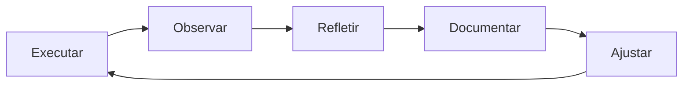

# 🪞 Reflexão sobre Processo

## Framework de Reflexão



## Perguntas de Reflexão

### Após cada projeto/tarefa:

**O que funcionou bem?**
- [Técnica/template X foi eficaz]

**O que não funcionou?**
- [Template Y estava incompleto]

**O que aprendeu?**
- [Nova heurística descoberta]

**O que faria diferente?**
- [Usaria metodologia Z]

## Template: Retrospectiva

```markdown
# Retrospectiva: [Projeto/Tarefa]

**Data:** [YYYY-MM-DD]
**Duração:** [X horas/dias]
**Tipo:** [Análise/Design/Implementação]

## Métricas
- Tempo estimado: [X]
- Tempo real: [Y]
- Eficiência: [Y/X * 100%]
- Iterações até solução: [N]

## O que funcionou ✅
1. [Item 1]
2. [Item 2]

## O que não funcionou ❌
1. [Item 1 + por quê]
2. [Item 2 + por quê]

## Aprendizados 💡
- [Insight 1]
- [Insight 2]

## Ações de Melhoria
- [ ] Atualizar template X com [mudança]
- [ ] Criar novo checklist para [caso]
- [ ] Documentar padrão [Y]
```

---

**Tags:** #reflexao #melhoria-continua #retrospectiva
