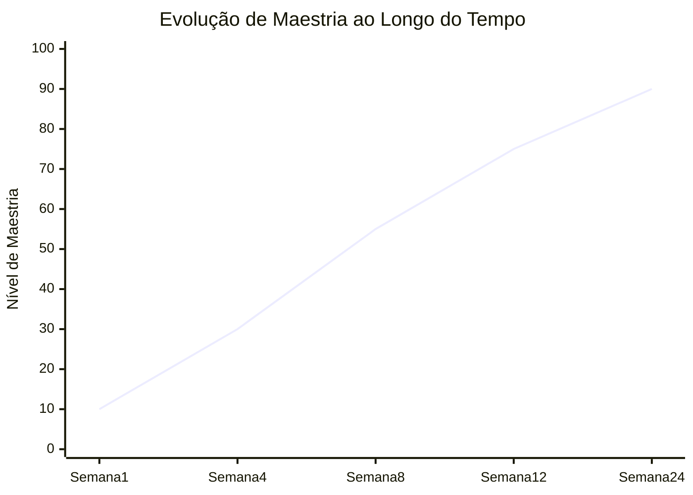
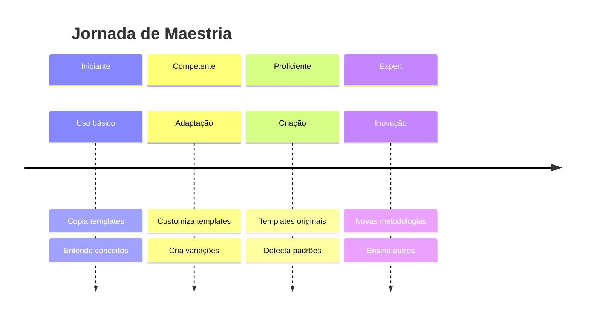

# 📈 Evolução de Técnicas

## Curva de Aprendizado



## Estágios de Evolução



## Indicadores de Progresso

| Nível | Indicador | Exemplo |
|-------|-----------|---------|
| 1 | Usa templates sem modificar | Copy-paste |
| 2 | Adapta templates para contexto | Preenche placeholders |
| 3 | Cria variações de templates | Customiza para domínio |
| 4 | Cria templates originais | Captura novos padrões |
| 5 | Cria metodologias novas | Framework próprio |

## Tracking de Evolução

```markdown
### Scorecard Mensal

**Mês:** [YYYY-MM]

**Templates Usados:** [N]
**Templates Criados:** [M]
**Templates Evoluídos:** [P]

**Metodologias Dominadas:**
- [ ] First Principles
- [ ] 5 Whys
- [ ] Pattern Detection
- [X] Custom: [Nova metodologia]

**Projetos Complexos:**
- Projeto 1: [Sucesso/Aprendizado]
- Projeto 2: [Sucesso/Aprendizado]

**Próximo Nível:**
- Skill a desenvolver: [X]
- Meta: [objetivo mensurável]
```

---

**Tags:** #evolucao #maestria #tracking
