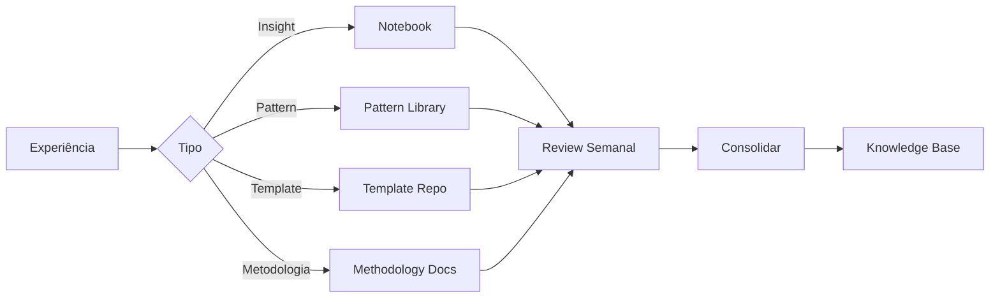

# 📝 Documentação de Aprendizados

## Sistema de Captura



## Template: Documentar Padrão

```markdown
# Pattern: [Nome]

**ID:** PATTERN-XXX
**Categoria:** [Code/Architecture/Process]
**Data:** [YYYY-MM-DD]

## Contexto
[Quando/onde aparece]

## Problema
[O que está errado]

## Solução
[Como resolver]

```[language]
// Código exemplo
```

## Consequências
✅ Benefícios: [lista]
❌ Trade-offs: [lista]

## Exemplos Reais
- Projeto A: [link]
- Projeto B: [link]

## Tags
#pattern #[categoria] #[tecnologia]
```

## Organização do Conhecimento

```
knowledge-base/
├── patterns/
│   ├── code/
│   ├── architecture/
│   └── process/
├── templates/
│   ├── analysis/
│   ├── design/
│   └── documentation/
├── methodologies/
│   ├── custom/
│   └── adapted/
└── learnings/
    ├── 2024/
    └── 2025/
```

---

**Tags:** #documentacao #conhecimento #organizacao
