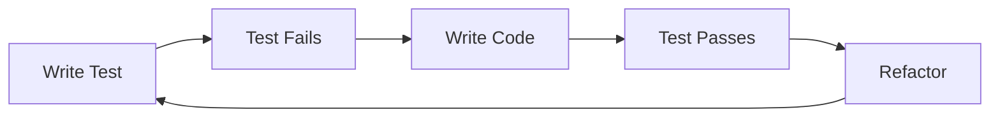

# 🎨 Pattern Library

Catálogo de patterns, anti-patterns e heurísticas.

## Code Patterns

### Pattern: Repository Pattern
**Categoria:** Data Access
**Problema:** Acoplamento direto entre lógica de negócio e persistência
**Solução:** Interface abstrata para acesso a dados

```javascript
// Repository interface
class UserRepository {
  async findById(id) { /* ... */ }
  async save(user) { /* ... */ }
}

// Usage
class UserService {
  constructor(userRepo) {
    this.repo = userRepo;
  }
  
  async getUser(id) {
    return await this.repo.findById(id);
  }
}
```

---

## Anti-Patterns

### Anti-Pattern: God Object
**Sintomas:**
- Classe com 1000+ linhas
- 50+ métodos
- Responsabilidades múltiplas

**Detecção:**
```bash
find . -name "*.js" -exec wc -l {} \; | sort -rn | head -10
```

**Solução:** Single Responsibility Principle

---

### Anti-Pattern: N+1 Query
**Problema:**
```javascript
// ❌ N+1 queries
const users = await db.query('SELECT * FROM users');
for (const user of users) {
  const orders = await db.query('SELECT * FROM orders WHERE user_id = ?', [user.id]);
}
```

**Solução:**
```javascript
// ✅ Single query com JOIN
const result = await db.query(`
  SELECT u.*, o.*
  FROM users u
  LEFT JOIN orders o ON u.id = o.user_id
`);
```

---

## Architectural Patterns

### Pattern: Microservices
**Quando usar:** Sistema grande, times autônomos, deploy independente
**Trade-offs:**
- ✅ Escalabilidade independente
- ✅ Tech stack flexível
- ❌ Complexidade operacional
- ❌ Network overhead

---

## Process Patterns

### Pattern: TDD (Test-Driven Development)
**Fluxo:**


---

## Heurísticas

| Heurística | Threshold | Ação |
|------------|-----------|------|
| Função muito longa | >50 linhas | Quebrar em funções menores |
| Complexidade alta | >10 | Simplificar lógica |
| Duplicação | >5% | Refatorar (DRY) |
| Acoplamento | >10 deps | Reduzir dependências |

---

**Tags:** #patterns #anti-patterns #heuristics #catalog
