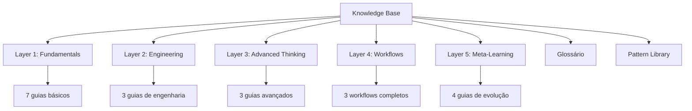
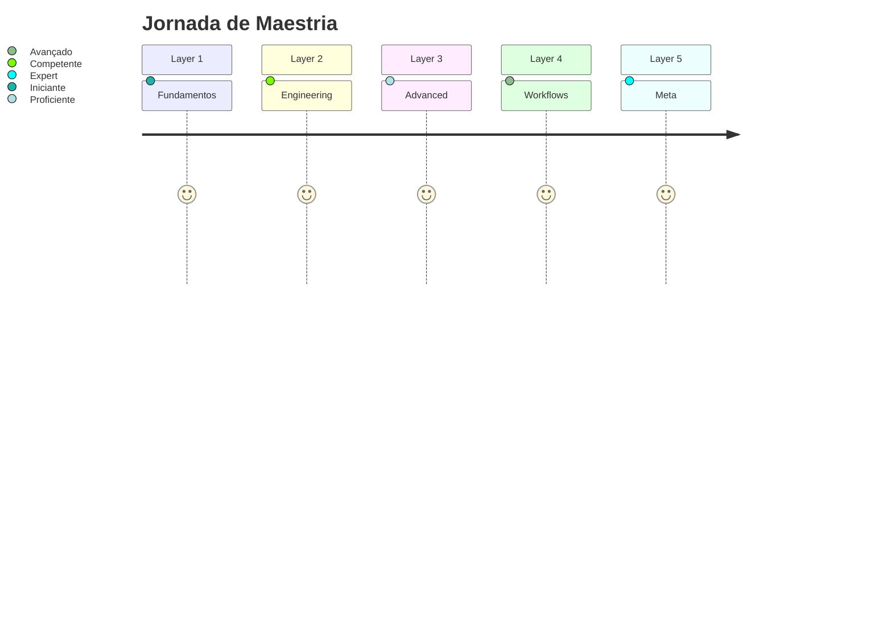

# 🎯 Knowledge Base - Meta-Learning sobre Prompt Engineering e Pensamento Sistemático

Sistema completo de conhecimento para dominar prompt engineering, análise técnica profunda e construção de soluções com IA.

## 🗺️ Estrutura do Knowledge Base

## 📚 Camadas de Conhecimento

### Layer 1: Fundamentals (Fundamentos)
**7 guias** cobrindo bases de prompt engineering

- [00-INDEX](./1-fundamentals/00-INDEX.md)
- 01-o-que-e-prompt-engineering
- 02-tipos-de-prompts
- 03-contexto-e-role-playing
- 04-refinamento-iterativo
- 05-ciclo-de-trabalho-com-ia
- 06-estruturacao-contexto
- 07-especificacao-requisitos

### Layer 2: Engineering (Engenharia)
**3 guias** sobre técnicas avançadas de engenharia

- [00-INDEX](./2-engineering/00-INDEX.md)
- 01-design-templates-universais
- 02-arquitetura-prompts-complexos
- 03-checklists-validacoes

### Layer 3: Advanced Thinking (Pensamento Avançado)
**3 guias** sobre metodologias e frameworks

- [00-INDEX](./3-thinking/00-INDEX.md)
- 01-metodologias-analise-profunda
- 02-deteccao-padroes-sistematica
- 03-decomposicao-problemas-complexos

### Layer 4: Workflows (Processos)
**3 workflows** completos e prontos para usar

- [00-INDEX](./4-workflows/00-INDEX.md)
- 01-workflow-analise-problemas
- 02-workflow-design-solucoes
- 03-workflow-documentacao-tecnica

### Layer 5: Meta-Learning (Meta-Aprendizado)
**4 guias** sobre evolução e sistema pessoal

- [00-INDEX](./5-meta/00-INDEX.md)
- 01-reflexao-processo
- 02-evolucao-tecnicas
- 03-documentacao-aprendizados
- 04-construcao-sistema-pessoal

## 📖 Recursos Centralizados

- **[GLOSSARIO.md](./GLOSSARIO.md)** - Definições de todos conceitos
- **[PATTERN-LIBRARY.md](./PATTERN-LIBRARY.md)** - Catálogo de patterns e anti-patterns

## 🎯 Como Usar Este Knowledge Base

### Para Iniciantes
1. Comece por [Layer 1: Fundamentals](./1-fundamentals/00-INDEX.md)
2. Leia na ordem (01 → 07)
3. Pratique cada conceito antes de avançar
4. Use [GLOSSARIO.md](./GLOSSARIO.md) quando necessário

### Para Usuários Intermediários
1. Identifique gaps no [Layer 1](./1-fundamentals/00-INDEX.md)
2. Pule para [Layer 2](./2-engineering/00-INDEX.md) ou [Layer 3](./3-thinking/00-INDEX.md)
3. Implemente workflows da [Layer 4](./4-workflows/00-INDEX.md)

### Para Avançados
1. Use [Layer 4 Workflows](./4-workflows/00-INDEX.md) como base
2. Customize com [Layer 5 Meta-Learning](./5-meta/00-INDEX.md)
3. Contribua patterns para [PATTERN-LIBRARY.md](./PATTERN-LIBRARY.md)

## 🧭 Navegação Rápida

**Por Tópico:**
- Análise de Problemas: L1-05, L3-01, L4-01
- Templates: L2-01, L2-02
- Validação: L2-03, L1-07
- Decomposição: L3-03
- Evolução Pessoal: L5 (todos)

**Por Tipo de Trabalho:**
- Auditoria de Código: L3-02, L4-01
- Design de Sistema: L4-02, L3-03
- Documentação: L4-03, L2-02

## 📊 Métricas de Progresso

Após dominar cada layer:

## 🤝 Contribuindo

Este é um knowledge base vivo. Para contribuir:

1. Identifique gaps ou melhorias
2. Crie novo pattern/template/guia
3. Siga estrutura existente
4. Documente com exemplos
5. Adicione ao índice apropriado

## 📝 Licença & Uso

Este knowledge base é de uso pessoal/profissional livre. Customize conforme suas necessidades.

---

**Versão:** 1.0.0  
**Última atualização:** 2025-11-06  
**Total de guias:** 20  
**Conceitos definidos:** 50+  
**Patterns catalogados:** 30+

**Start here:** [Layer 1 - Fundamentals](./1-fundamentals/00-INDEX.md)
